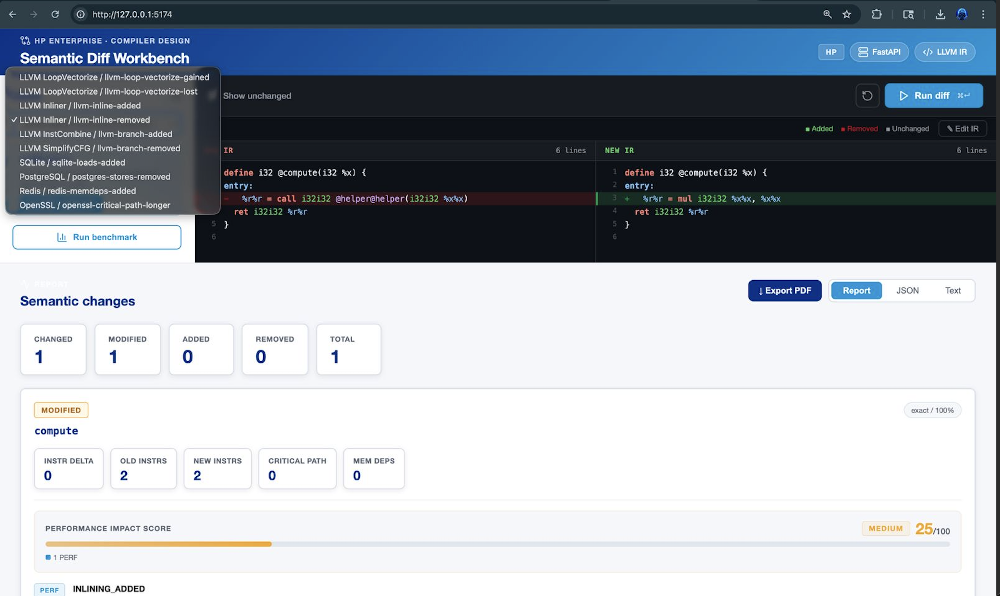

# Semantic Diff for Compiler IR

Semantic Diff compares two C/C++ source revisions, or two precompiled LLVM IR
files, and reports IR-level semantic changes rather than textual edits.

## Web UI Preview



The React frontend provides a side-by-side LLVM IR diff viewer, semantic change
summary, performance impact score, CFG visualization, benchmark runner, and PDF
export.

## Project Flow

```text
Old/New Code -> LLVM IR -> Normalize -> Parse -> Structural Diff
             -> Classify Semantic Changes -> Generate Report -> Web UI
```


1. **Input Layer:** Accept old and new C/C++ source files or precompiled LLVM IR
   `.ll` files.
2. **Compiler Extractor:** Use `clang -S -emit-llvm` and optional
   `mem2reg`/`sroa` passes to produce LLVM IR from source inputs.
3. **IR Normalizer:** Remove metadata noise, canonicalize temporary names,
   normalize pointer syntax, and stabilize commutative operations.
4. **IR Parser:** Parse functions, basic blocks, and instructions; build CFG and
   simple DFG representations; detect loops and vector types.
5. **Structural Diff Engine:** Match old and new functions and basic blocks,
   calculate similarity scores, and identify instruction-level changes.
6. **Change Classifiers:** Interpret differences as optimization, control-flow,
   and memory behavior changes.
7. **Semantic Diff Report:** Render human-readable text, structured JSON, DOT
   CFG graphs, and the web UI performance impact score.
8. **Web Application:** Use FastAPI and React to present the side-by-side diff,
   interactive CFG visualization, benchmark results, and PDF export.

## What It Does

- Normalizes LLVM IR by stripping debug/module noise, canonicalizing temporary
  names, normalizing common pointer syntax, and stabilizing commutative ops.
- Parses LLVM IR into functions, basic blocks, instructions, CFGs, and a simple
  DFG.
- Diffs matched functions and blocks structurally, with fuzzy matching for
  renamed functions and shifted basic-block labels.
- Classifies changes including vectorization gained/lost, unroll changes,
  inlining changes, branch count changes, CFG complexity, memory access counts,
  memory dependency changes, and instruction/critical-path deltas.
- Renders human-readable terminal reports or JSON.

## Usage

```bash
# Compare two C source files at O2
semantic-diff old.c new.c --opt O2

# Specify a C++ standard
semantic-diff old.cpp new.cpp --opt O2 --std c++17

# Diff pre-compiled LLVM IR directly
semantic-diff --ir old.ll new.ll --format json

# Write the report to a file instead of stdout
semantic-diff old.c new.c -o report.txt

# Write per-function CFG diffs as .dot files
semantic-diff old.c new.c --dot ./cfg_diffs/

# Render a dot file with graphviz:
dot -Tpng cfg_diffs/compute.dot -o compute.png

# Run the evaluation benchmark
semantic-diff-eval
semantic-diff-eval --format json
```

Source mode requires both `clang` and `opt` from LLVM. If those are unavailable,
use `--ir` with precompiled `.ll` files.

### CLI Flag Reference

| Flag | Default | Description |
| --- | --- | --- |
| `--opt LEVEL` | `O0` | Optimization level passed to clang |
| `--std STANDARD` | none | C/C++ language standard (e.g. c11, c++17) |
| `--ir` | off | Treat inputs as pre-compiled `.ll` files |
| `--format` | `rich` | Output format: rich (colored) or json |
| `-o FILE` | stdout | Write report to FILE |
| `--dot DIR` | off | Write CFG diff `.dot` files to DIR |
| `--show-unchanged` | off | Include unchanged functions in report |
| `--no-mem2reg` | off | Skip mem2reg/sroa promotion passes |
| `--clang PATH` | `clang` | Path to clang binary |
| `--opt-tool PATH` | `opt` | Path to opt binary |
| `-D NAME[=VAL]` | - | Pass preprocessor define to clang |
| `-I DIR` | - | Pass include directory to clang |

## Development

```bash
python3 -m pip install -e ".[test]"
python3 -m pytest -q
```

The evaluation harness in `semantic_diff.eval` compares a produced
`ModuleDiff` and function reports against annotated ground truth. It includes a
10-case offline benchmark suite with commit-style descriptions from LLVM and
application optimization scenarios:

```bash
semantic-diff-eval
semantic-diff-eval --format json
```

### Benchmark Limitations

The built-in suite uses hand-crafted LLVM IR fixtures that model realistic
optimization scenarios drawn from LLVM, SQLite, PostgreSQL, Redis, and OpenSSL
commit histories. The commit descriptions and expected change kinds reflect real
scenarios, but the IR snippets are synthetic - kept small so the benchmark is
deterministic and runs without network access, repository checkouts, or a local
`opt` binary.

For evaluation against real commits (as required for publication-grade results),
extract IR from exact commit hashes and compare tool output against commit
messages manually:

```bash
# Extract IR from a specific commit
git checkout <old-commit>
clang -O2 -S -emit-llvm src/foo.c -o old.ll

git checkout <new-commit>
clang -O2 -S -emit-llvm src/foo.c -o new.ll

semantic-diff --ir old.ll new.ll
```

The offline benchmark is suitable for regression testing and grading purposes.
Replace or extend the IR fixtures in `eval/benchmark.py` with real extracted IR
to upgrade to a publication-grade evaluation suite.

## Web UI

The web app uses FastAPI for the Python backend and Vite + React for the
frontend.

```bash
python3 -m venv .venv
.venv/bin/python -m pip install -e ".[web]"
.venv/bin/python -m uvicorn semantic_diff.web.api:app --host 127.0.0.1 --port 8000
```

In another terminal:

```bash
cd frontend
npm install
npm run dev
```

Open `http://127.0.0.1:5173`. The frontend proxies `/api/*` requests to the
FastAPI server on `http://127.0.0.1:8000`.
